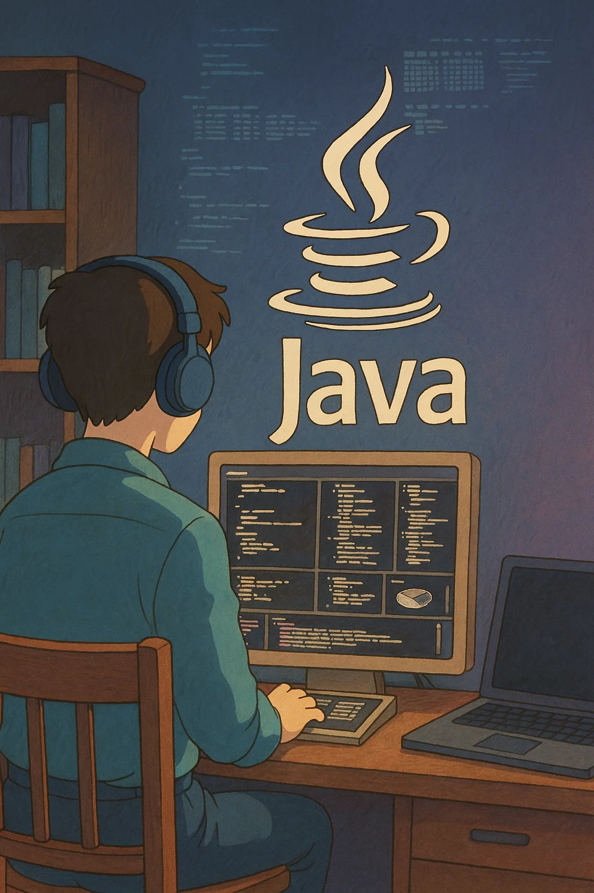
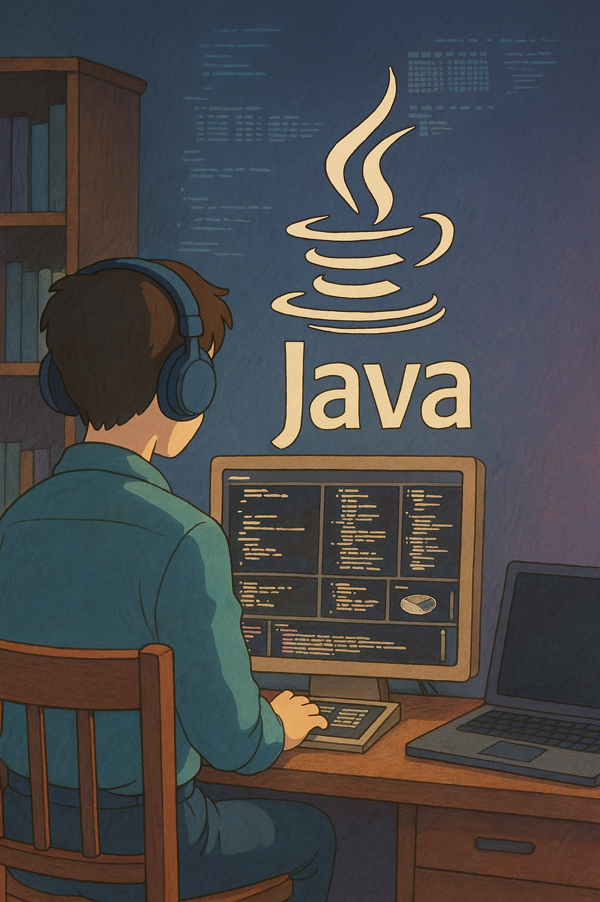

# Java : Zero to Advance Course

### Unlock the Power of Java Programming: Your Journey Begins Here!

Dive into the world of Java, the backbone of countless applications and systems worldwide. Whether you're an aspiring developer or looking to enhance your tech skills, our comprehensive Java Programming course is designed to take you from a novice to a proficient programmer.

### What You’ll Learn:

Foundations of Java: Grasp the core concepts, from variables and data types to control structures and loops.

Object-Oriented Programming: Master the principles of OOP, including inheritance, polymorphism, and encapsulation.

Advanced Topics: Explore threads, collections, and exception handling to build robust and efficient applications.

Hands-On Projects: Apply your knowledge through real-world projects and coding challenges, solidifying your understanding and showcasing your skills.

  
   
   

